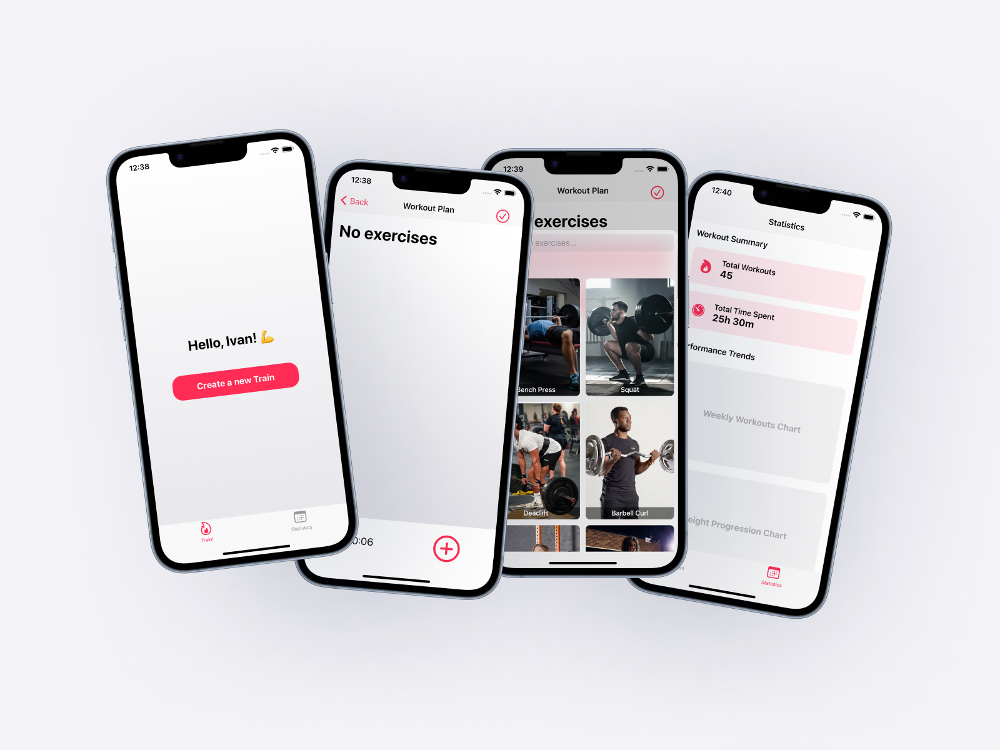

# Workout Plan App 🏋️‍♂️

## Overview
The **Workout Plan App** is designed to help users create and manage personalized workout routines with ease. This app provides a clean and intuitive interface for tracking exercises, viewing statistics, and monitoring progress over time. Whether you're a fitness beginner or a seasoned athlete, this app helps you stay on top of your fitness goals.

## Features
- **Create a New Workout**: Start building your workout plan with a simple and friendly interface.
- **Add Exercises**: Choose from a selection of exercises with images and names to build your perfect routine.
- **Track Your Statistics**: Stay updated on your progress with performance statistics such as total workouts completed, total time spent, and weekly workout charts.
- **Progress Visualization**: View trends and improvements with charts that display your workout data over time (coming soon).
- **Customizable Workouts**: Modify and adjust your training plans as you grow stronger and fitter.
- **Minimalistic Design**: Clean and modern interface with easy navigation between screens.

## Preview



## Installation
To get started with the **Workout Plan App**, follow these steps:
1. Clone the repository:
   ```bash
   git clone https://github.com/ChabanovX/gym-tracker.git
   ```
2. Open the project in your favorite IDE.
3. Run the project on your local development environment or simulator (iOS/Android).

## Usage

- Tap __"Create a new Train"__ to start creating your workout.
- Add exercises by selecting from the provided list.
- Switch to the **Statistics** tab to review your performance data and trends.
- Edit your workout anytime by adding or removing exercises.


## Future Enhancements

- __Progression Charts__: Visual representation of progress in weekly and monthly workouts.
- __Exercise Recommendations__: Suggested exercises based on user performance and history.
- __Social Sharing__: Share your workout achievements with friends and the fitness community.

## Contributing

We welcome contributions to enhance the app and make it better for everyone. Feel free to submit pull requests or open issues for any bugs or feature requests.

## License

This project is licensed under the MIT License - see the LICENSE file for details.
